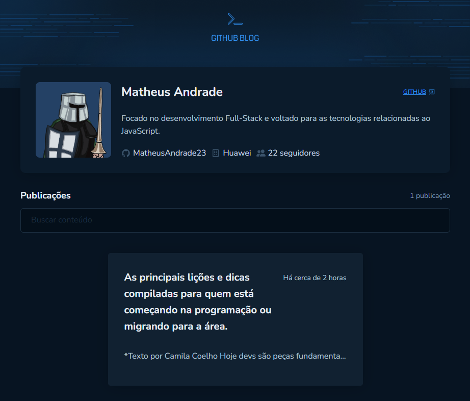
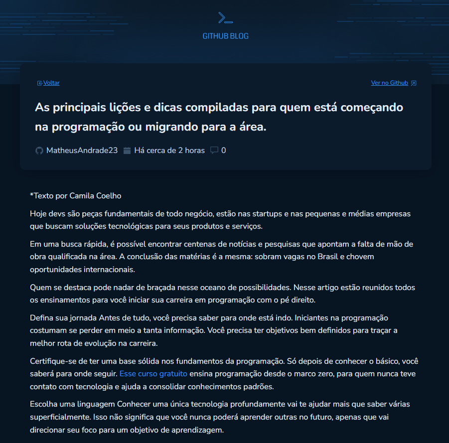

<h1 align="center">GitHub Blog 💻</h1>

  

<h3 align="center">GitHub Blog desenvolvido com React + bibliotecas como desafio do ignite, da Rocketseat.</h3>

<h4 align="center">Neste projeto, cada issue criada nesse repositório é um post do nosso blog. Todos os dados do usuário e dos posts (issues) são obtidos através da API do GitHub.</h4>

---

<h2>Design 🎨</h2>

_<h3>Home</h3>_

##

_<h3>Post</h3>_

---

<h2>Tecnologias Utilizadas 🛠</h2>

#### FrontEnd: `ReactJS!`

- Axios
- React Icons
- React Hook Form
- Typescript
- Date-fns
- React Router Dom
- React Markdown

 
  
  
  
  
 

 

---

